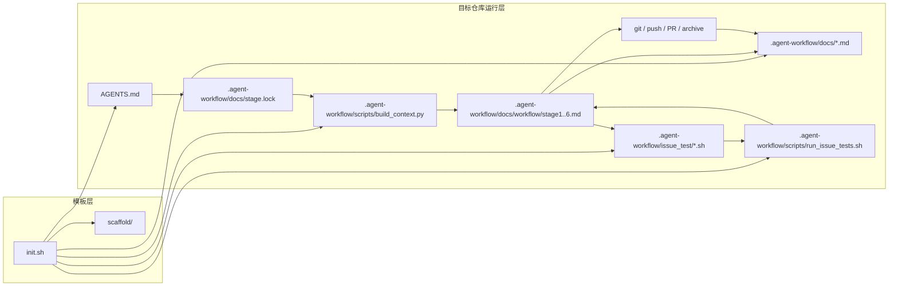
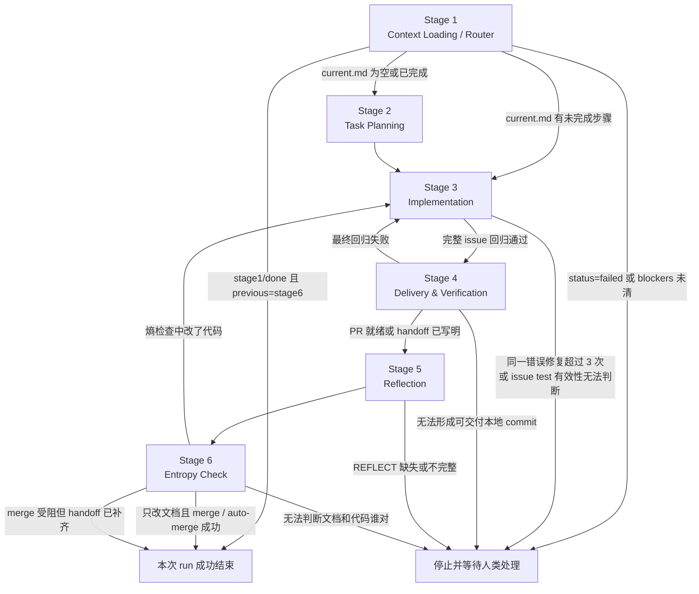

# Agent Workflow Template

🌐 [English](README.en.md)

一个把 AI agent 开发流程拆成"初始化脚手架 + 文档状态机 + issue 级累积回归"的模板仓库。

它解决的不是"怎么写 prompt"，而是"怎么把 agent 的工作流程变成可重复执行、可验证、可中断恢复的工程系统"。

## 实仓验证

这套流程已经在真实 GitHub 仓库里完整跑通过一次，不只是模板内自测。

- 验证日期：2026-03-29
- 目标仓库：[cf3i/MiniAVLtree](https://github.com/cf3i/MiniAVLtree)
- 验证任务：在 `.agent-workflow/docs/plan/backlog.md` 中新增"为 AVL 树新增 HTML 可视化页面"
- Stage 2：按规则创建独立工作分支 `codex/2-html-avl-visualizer`
- Stage 4：通过 `bash .agent-workflow/scripts/deliver_pr.sh ensure --base main` 创建 PR [#2](https://github.com/cf3i/MiniAVLtree/pull/2)
- Stage 6：通过 `bash .agent-workflow/scripts/deliver_pr.sh merge --merge-method squash` 完成最终 merge
- 最终状态：目标仓库回到 `stage1 / done / previous=stage6`

这次实仓回归还顺手抓到了一个真实问题：`deliver_pr.sh` 在输出 `MERGE_COMMIT_SHA` 时，`gh --jq` 的引号写法有误。该问题已修复，并回写到模板本身。

## 这个项目怎么用

### 1. 用 `init.sh` 初始化你的目标仓库

前提：

- 目标目录必须已经是 Git 仓库。
- 目标目录不能是本模板仓库自身。
- 本机需要 `python3` 和 `PyYAML`，因为 `.agent-workflow/scripts/build_context.py` 依赖它。
- 如果要自动填充文档，需要可用的 AI CLI，例如 `codex` 或 `claude`。

典型用法：

```bash
# 在你的目标项目里执行，不是在本模板仓库里执行
cd /path/to/your-repo

# 交互式初始化
bash /path/to/Agent-Workflow-Template/init.sh

# 非交互式 adopt 模式
bash /path/to/Agent-Workflow-Template/init.sh \
  --adopt \
  --cli codex \
  --ultra \
  --non-interactive

# 只复制骨架，不自动填文档
bash /path/to/Agent-Workflow-Template/init.sh \
  --skip-fill \
  --non-interactive
```

`init.sh` 支持的核心参数：

| 参数 | 作用 |
| --- | --- |
| `--adopt` | 接入一个已经存在的仓库，文档优先描述"当前事实" |
| `--greenfield` | 面向全新项目初始化 |
| `--skip-fill` | 只复制骨架，不调用 AI 填充文档 |
| `--cli <claude\|codex>` | 指定初始化时调用的 CLI |
| `--model <name>` | 给 `codex` 指定模型 |
| `--reasoning-effort <level>` | 给 `codex` 指定推理强度 |
| `--single-call` | 用一次 AI 调用填完所有文档 |
| `--ultra` | 按文件分步调用 AI 填文档 |
| `--lang <zh\|en>` | 选择文档语言（默认：zh） |
| `--docs-review` / `--no-docs-review` | 是否额外做一轮只读文档复核 |
| `--non-interactive` | 禁用交互式向导 |

补充说明：

- 脚本内建默认值是 `claude + gpt-5.4 + xhigh`。
- 如果你使用 `codex` 且没有显式指定执行模式，脚本会默认切到 `--ultra`；独立 docs review 仍默认开启，除非显式传 `--no-docs-review`。
- `init.sh` 会拒绝在非 Git 仓库中运行，因为这个 workflow 依赖 `stage.lock` commit、分支和 PR 交付。

### 2. 初始化后怎么开始跑

初始化成功后，目标仓库里会得到：

- `.agent-workflow/AGENTS.md`：Agent 启动协议和硬规则
- `.agent-workflow/docs/`：状态机、项目上下文、计划、阻塞、决策
- `.agent-workflow/issue_test/`：每个 issue 对应的独立回归脚本
- `.agent-workflow/scripts/`：上下文装载器和 issue test 运行器

日常运行方式：

```bash
# Agent 启动入口
bash .agent-workflow/scripts/start_agent.sh

# 手工查看当前 Stage 会加载哪些上下文
python3 .agent-workflow/scripts/build_context.py --stage <current_stage>

# 跑历史 + 当前 issue 的累积回归
bash .agent-workflow/scripts/run_issue_tests.sh

# 跑历史回归，但排除当前 issue 的脚本
bash .agent-workflow/scripts/run_issue_tests.sh --exclude .agent-workflow/issue_test/<issue_id>.sh
```

`start_agent.sh` 现在会以“每个 issue 一个全新 Codex session”的方式连续运行，但默认仍保持 Codex 原本的交互界面：一个 issue 闭环完成后，脚本会先结束当前 session，再重新启动下一轮，避免上下文在多个 issue 间无限累积。若只想跑一轮，可用 `bash .agent-workflow/scripts/start_agent.sh --once`；若想看启动器日志，可临时加 `--verbose` 或设置 `CODEX_LAUNCHER_VERBOSE=1`。

### 2.4 升级已安装的 workflow 规则

如果另一个仓库已经有 `.agent-workflow/`，不要重跑 `init.sh`。现在可以直接用模板仓库里的升级脚本，只同步模板拥有的规则文件，并保留原仓库的状态与历史：

```bash
bash /path/to/Agent-Workflow-Template/scripts/upgrade_workflow_rules.sh /path/to/target-repo
```

它会：

- 同步 `.agent-workflow/AGENTS.md`、`docs/workflow/stage*.md`、`scripts/*.sh`、`scripts/build_context.py`、`issue_test/README.md`、`docs/plan/archive/README.md`
- 仅在缺失时补 `docs/environment.md` 和 `docs/run_log.md`
- 保留 `docs/stage.lock`、`docs/blockers.md`、`docs/plan/current.md`、`docs/plan/archive/*`、`docs/progress.md`、`docs/decisions.md`、`results/`
- 自动确保 `/.agent-workflow/` 写入目标仓库的 `.git/info/exclude`

若目标仓库使用英文 scaffold，可加：

```bash
bash /path/to/Agent-Workflow-Template/scripts/upgrade_workflow_rules.sh /path/to/target-repo --lang en
```

### 2.5 开发一个新任务时，先写 `backlog.md`

这个模板里，"要开发什么"的正式入口不是直接改代码，也不是先写 `current.md`，而是先把任务写进 `.agent-workflow/docs/plan/backlog.md`。

推荐顺序：

1. 在 `.agent-workflow/docs/plan/backlog.md` 里新增一个 `- [ ]` 条目
2. 启动 agent
3. Stage 2 从 backlog 里选择一个条目
4. Stage 2 生成 `issue_id`
5. Stage 2 创建 `.agent-workflow/issue_test/<issue_id>.sh`
6. Stage 2 把实施步骤写入 `.agent-workflow/docs/plan/current.md`
7. Stage 3 开始实现，Stage 4 完成后把 backlog 条目标记为 `- [x]`

角色分工是：

- `.agent-workflow/docs/plan/backlog.md`：定义"接下来要做什么"
- `.agent-workflow/docs/plan/current.md`：定义"当前这个 issue 怎么一步步做"
- `.agent-workflow/issue_test/<issue_id>.sh`：定义"这个 issue 做完后怎么验收"

也就是说，`backlog.md` 是开发入口，`current.md` 是执行中计划，`issue_test` 是验收脚本。

如果当前 issue 包含实验、评测或 smoke test，实验结果必须写入 `results/issue<issue_id>/`，并在 `results/issue<issue_id>/SUMMARY.md` 中为每次实验追加总结，记录模型、工作流、input length、关键设定、结果与尝试分析。

### 3. `init.sh` 实际做了什么

`init.sh` 不是简单复制文件。它把模板初始化分成四类动作：

| 类别 | 处理方式 | 文件 |
| --- | --- | --- |
| 固定骨架 | 直接从 `scaffold/<lang>/` 复制 | `.agent-workflow/docs/stage.lock`、`.agent-workflow/docs/run_log.md`、`.agent-workflow/docs/environment.md`、`.agent-workflow/docs/workflow/stage*.md`、`.agent-workflow/docs/wisdom.md`、`.agent-workflow/docs/antipatterns.md`、`.agent-workflow/docs/blockers.md`、`.agent-workflow/docs/plan/current.md`、`.agent-workflow/docs/plan/archive/README.md`、`.agent-workflow/issue_test/README.md`、`.agent-workflow/scripts/build_context.py`、`.agent-workflow/scripts/run_issue_tests.sh`、`.agent-workflow/scripts/deliver_pr.sh` |
| AI 填充 | 先复制模板，再调用 AI 按目标仓库事实填充 | `.agent-workflow/docs/overview.md`、`.agent-workflow/docs/architecture.md`、`.agent-workflow/docs/conventions.md`、`.agent-workflow/docs/quality.md`、`.agent-workflow/docs/security.md`、`.agent-workflow/docs/progress.md`、`.agent-workflow/docs/plan/backlog.md` |
| 脚本直写 | 复制后由脚本替换占位符 | `.agent-workflow/docs/decisions.md` 中的 `D-001` 日期和初始化背景 |
| 延后复制 | 在 AI 填充结束后再复制，避免影响初始化 prompt | `.agent-workflow/AGENTS.md` |

初始化过程中，脚本还会在目标仓库的 `.git/.agent-workflow-init/` 目录下生成运行产物：

- `logs/*.log`：每一步 AI 调用日志
- `final-review.md`：本地规则生成的人工补充清单
- `docs-review.md`：可选的只读文档复核报告

## 项目架构

这个仓库本质上由两层组成：

1. 模板层：`init.sh + scaffold/`
2. 运行层：被初始化到目标仓库中的 `.agent-workflow/AGENTS.md + .agent-workflow/docs/ + .agent-workflow/issue_test/ + .agent-workflow/scripts/`

模板层负责"生成运行系统"，运行层负责"驱动 agent 工作"。

### 顶层结构

```text
Agent-Workflow-Template/
├── init.sh
├── scaffold/
│   ├── zh/          ← 中文 scaffold 文件
│   │   ├── AGENTS.md
│   │   ├── .agent-workflow/docs/
│   │   ├── .agent-workflow/issue_test/
│   │   └── .agent-workflow/scripts/
│   └── en/          ← 英文 scaffold 文件
│       ├── AGENTS.md
│       ├── .agent-workflow/docs/
│       ├── .agent-workflow/issue_test/
│       └── .agent-workflow/scripts/
├── .agent-workflow/docs/
├── .agent-workflow/issue_test/
└── .agent-workflow/scripts/
```

这里要注意两点：

- `scaffold/` 是模板源文件，给别的仓库复制用。
- 仓库根目录下当前的 `.agent-workflow/docs/`、`.agent-workflow/issue_test/`、`.agent-workflow/scripts/` 是这个模板仓库自己的一份工作副本，用来维护和验证模板本身。

### 运行时分层

| 层 | 组件 | 职责 |
| --- | --- | --- |
| Bootstrap 层 | `init.sh`、`scaffold/` | 初始化目标仓库，复制骨架并填充首批文档 |
| Control 层 | `.agent-workflow/AGENTS.md`、`.agent-workflow/docs/stage.lock`、`.agent-workflow/docs/workflow/stage*.md` | 定义 agent 启动协议、当前状态和 Stage 跳转规则 |
| Context 层 | `.agent-workflow/docs/overview.md`、`architecture.md`、`conventions.md`、`environment.md`、`quality.md`、`security.md`、`progress.md`、`run_log.md`、`decisions.md`、`blockers.md`、`wisdom.md`、`antipatterns.md`、`.agent-workflow/docs/plan/*` | 提供项目事实、规则、环境前提、计划、运行历史和阻塞信息 |
| Harness 层 | `.agent-workflow/scripts/build_context.py`、`.agent-workflow/issue_test/*.sh`、`.agent-workflow/scripts/run_issue_tests.sh` | 机械装载上下文，机械执行累积回归 |
| Delivery 层 | `git commit`、`git push`、`.agent-workflow/scripts/deliver_pr.sh`、`.agent-workflow/docs/plan/archive/*` | 把变更转成可交付结果，并沉淀归档 |

### 架构关系图



## `scaffold/` 是什么

`scaffold/` 不是示例代码目录，它是初始化时的"文件母版"。

初始化目标仓库时，`init.sh` 不会读取根目录下当前运行中的 `.agent-workflow/docs/` 作为源，而是严格从 `scaffold/<lang>/` 拿模板文件。

`scaffold/<lang>/` 里的内容可以分成三类：

| 类别 | 典型文件 | 用途 |
| --- | --- | --- |
| 状态机骨架 | `.agent-workflow/AGENTS.md`、`.agent-workflow/docs/stage.lock`、`.agent-workflow/docs/workflow/stage*.md` | 定义 agent 的固定运行协议 |
| 项目事实模板 | `.agent-workflow/docs/overview.md`、`.agent-workflow/docs/architecture.md`、`.agent-workflow/docs/conventions.md`、`.agent-workflow/docs/quality.md`、`.agent-workflow/docs/security.md`、`.agent-workflow/docs/progress.md`、`.agent-workflow/docs/plan/backlog.md` | 初始化时由 AI 根据目标仓库内容填充 |
| Harness 脚本 | `.agent-workflow/scripts/build_context.py`、`.agent-workflow/scripts/run_issue_tests.sh`、`.agent-workflow/issue_test/README.md` | 把"读什么"和"怎么验证"变成固定脚本 |

换句话说：

- `scaffold/` 决定"新仓库会被初始化成什么样"
- `.agent-workflow/docs/` 决定"当前这个仓库现在是什么状态"

## 运行模型

单次 agent run 只允许完成一个 issue 闭环。

标准循环是：

1. 读 `.agent-workflow/AGENTS.md`
2. 读 `.agent-workflow/docs/stage.lock`
3. 执行 `python3 .agent-workflow/scripts/build_context.py --stage <current>`
4. 按输出读取全部上下文文件
5. 执行 `.agent-workflow/docs/workflow/<current>.md`
6. 更新 `.agent-workflow/docs/stage.lock`
7. 如果回到 `current: stage1` 且 `status: done` 且 `previous: stage6`，本次 run 结束

这意味着：

- 不允许在同一次 run 里连续领取多个 backlog issue。
- 任何 Stage 失败都要写 `.agent-workflow/docs/blockers.md` 并停止。
- 默认只需更新 `stage.lock` 本地状态；只有团队明确跟踪 workflow 状态文件时，才需要单独提交。
- 新任务必须先进入 `.agent-workflow/docs/plan/backlog.md`，再由 Stage 2 转成 `current.md` 和 `.agent-workflow/issue_test/<issue_id>.sh`。

## Stage 输入模型

`.agent-workflow/scripts/build_context.py` 会先注入全局上下文，再按 Stage 注入增量上下文。

所有 Stage 都会加载：

- `.agent-workflow/docs/overview.md`
- `.agent-workflow/docs/architecture.md`
- `.agent-workflow/docs/conventions.md`
- `.agent-workflow/issue_test/README.md`
- `.agent-workflow/docs/wisdom.md`、`.agent-workflow/docs/antipatterns.md`（如果存在）

各 Stage 的增量输入如下：

| Stage | 额外输入 |
| --- | --- |
| Stage 1 | `.agent-workflow/docs/stage.lock`、`.agent-workflow/docs/progress.md`、`.agent-workflow/docs/blockers.md`、`.agent-workflow/docs/plan/current.md`、`.agent-workflow/docs/workflow/stage1.md` |
| Stage 2 | `.agent-workflow/docs/plan/backlog.md`、`.agent-workflow/docs/decisions.md`、`.agent-workflow/docs/workflow/stage2.md` |
| Stage 3 | `.agent-workflow/docs/plan/current.md`、`.agent-workflow/docs/security.md`、`.agent-workflow/issue_test/<issue_id>.sh`、`.agent-workflow/docs/workflow/stage3.md` |
| Stage 4 | `.agent-workflow/docs/plan/current.md`、`.agent-workflow/docs/quality.md`、`.agent-workflow/issue_test/<issue_id>.sh`、`.agent-workflow/docs/workflow/stage4.md` |
| Stage 5 | `.agent-workflow/docs/decisions.md`、`.agent-workflow/docs/plan/archive/<issue_id>.md`、`.agent-workflow/docs/workflow/stage5.md` |
| Stage 6 | `.agent-workflow/docs/progress.md`、`.agent-workflow/docs/decisions.md`、`.agent-workflow/docs/plan/archive/<issue_id>.md`、`.agent-workflow/docs/workflow/stage6.md` |

这个设计的重点是：每个 Stage 只读它真正需要的文件，不让 agent 在无关文档里游走。

## Stage 之间的流程图



## 每个 Stage 的输入、输出、修改面

| Stage | 输入 | 输出 | 修改什么 |
| --- | --- | --- | --- |
| Stage 1 | `stage.lock`、`progress.md`、`blockers.md`、`plan/current.md` | 路由结果：结束当前 run，或进入 Stage 2 / Stage 3 | `.agent-workflow/docs/stage.lock` |
| Stage 2 | `plan/backlog.md`、`decisions.md`、`overview.md`、`antipatterns.md` | 确定 `issue_id`、切到当前 issue 的独立分支、创建当前 issue test、写好 `current.md`、把状态推进到 Stage 3 | Git 当前工作分支、`.agent-workflow/issue_test/<issue_id>.sh`、`.agent-workflow/docs/plan/current.md`、`.agent-workflow/docs/stage.lock`，必要时改 `.agent-workflow/docs/overview.md` 和 `.agent-workflow/docs/decisions.md` |
| Stage 3 | `plan/current.md`、`security.md`、当前 issue test、历史 issue tests、业务代码 | 代码实现完成，完整回归通过，推进到 Stage 4 | 业务代码、测试、`.agent-workflow/docs/plan/current.md`、`.agent-workflow/docs/stage.lock`，必要时改 `.agent-workflow/docs/architecture.md` 和 `.agent-workflow/docs/decisions.md` |
| Stage 4 | `plan/current.md`、`quality.md`、完整回归结果、git 远端状态 | 本地 commit、PR URL 或人工 handoff、进度更新、计划归档、推进到 Stage 5 | Git 历史、`.agent-workflow/docs/progress.md`、`.agent-workflow/docs/plan/archive/<issue_id>.md`、`.agent-workflow/docs/plan/current.md`、`.agent-workflow/docs/plan/backlog.md`、`.agent-workflow/docs/stage.lock` |
| Stage 5 | `decisions.md`、归档计划、当前 issue 上下文 | 反思结果、REFLECT 文件、可复用经验或反模式、推进到 Stage 6 | `.agent-workflow/docs/plan/archive/REFLECT-<issue_id>.md`、`.agent-workflow/docs/wisdom.md`、`.agent-workflow/docs/antipatterns.md`、`.agent-workflow/docs/stage.lock`，必要时改 `.agent-workflow/docs/decisions.md`、`.agent-workflow/docs/architecture.md`、`.agent-workflow/docs/conventions.md` |
| Stage 6 | 全局文档、`progress.md`、`decisions.md`、`plan/archive/<issue_id>.md`、代码现状、PR 状态 | 文档与代码对齐；若只改文档则尝试最终 merge / auto-merge 后结束 run；若改了代码则回到 Stage 3 | `.agent-workflow/docs/*.md`、`.agent-workflow/docs/stage.lock`、必要时补写 `.agent-workflow/docs/plan/archive/<issue_id>.md`，以及最终远端 merge 状态 |

## 每个 Stage 的流程

### Stage 1: Context Loading / Router

目标：判断当前 run 应该结束、恢复未完成 issue，还是开始挑选新 issue。

流程：

1. 先读 `.agent-workflow/docs/stage.lock`
2. 如果 `status == failed`，直接停止，等待人类处理
3. 如果已经是 `stage1 + done + previous=stage6`，说明上一个 issue 闭环刚完成，本次 run 成功结束
4. 如果 `status == in_progress`，直接跳到 `stage.lock.current`
5. 如果 `status == done`，再检查 `.agent-workflow/docs/blockers.md`
6. blockers 清空后，检查 `.agent-workflow/docs/plan/current.md`
7. `current.md` 有未完成 checkbox，就去 Stage 3；否则去 Stage 2

这一阶段只负责路由，不负责任务实现。

### Stage 2: Task Planning

目标：从 backlog 中选一个 issue，把它转成"可执行计划 + 可执行测试"。

流程：

1. 先读 `.agent-workflow/docs/antipatterns.md`，看当前任务是否命中过往失败模式
2. 从 `.agent-workflow/docs/plan/backlog.md` 里按 P0 → P1 → P2 选择一个未完成任务
3. 对照 `.agent-workflow/docs/overview.md` 检查这个任务是否仍在项目范围内
4. 生成 `issue_id`
5. 创建并切换到当前 issue 的独立工作分支，默认命名 `codex/<issue_id>`
6. 创建 `.agent-workflow/issue_test/<issue_id>.sh`
7. 把执行步骤写进 `.agent-workflow/docs/plan/current.md`
8. 如果发生范围变化或关键技术选择，追加写入 `.agent-workflow/docs/decisions.md`
9. 更新 `.agent-workflow/docs/stage.lock` 到 Stage 3

这个阶段的核心约束是：没有 issue test，就不能进入实现阶段。

### Stage 3: Implementation

目标：先守住历史，再实现当前 issue，并让完整回归重新变绿。

流程：

1. 先跑历史 issue 回归基线：排除当前 issue test
2. 再跑当前 issue 的测试脚本，确认它真的在验证目标行为
3. 按 `.agent-workflow/docs/plan/current.md` 实现代码，并在完成后勾选步骤
4. 如果涉及敏感内容，先读 `.agent-workflow/docs/security.md`
5. 如果实现过程改变了架构边界，要同步更新 `.agent-workflow/docs/architecture.md` 并追加 `.agent-workflow/docs/decisions.md`
6. 跑完整 issue 回归套件
7. 全通过后，把状态推进到 Stage 4

这个阶段真正修改的是业务代码和测试，同时保证历史 issue 不被回归破坏。

### Stage 4: Delivery & Verification

目标：把"代码能跑"变成"可以交付"。

流程：

1. 再跑一次完整 issue 回归，作为最终 gate
2. 按 `.agent-workflow/docs/quality.md` 做人工自查
3. 创建可交付的本地 commit
4. 执行 `bash .agent-workflow/scripts/deliver_pr.sh ensure --base <base-branch>`，推送当前 issue 分支并创建或复用 PR
5. 如果远端交付受网络、权限或宿主环境限制，可以降级为"本地交付 + 人工 handoff"
6. 更新 `.agent-workflow/docs/progress.md`
7. 归档 `.agent-workflow/docs/plan/current.md` 到 `.agent-workflow/docs/plan/archive/<issue_id>.md`，写入 PR URL 或 handoff 信息
8. 清空并重置 `.agent-workflow/docs/plan/current.md`
9. 把对应 backlog 条目标为 `[x]`
10. 更新 `.agent-workflow/docs/stage.lock` 到 Stage 5

这里的关键不是"Stage 4 就要 merge 成功"，而是"必须先形成可复现、可 handoff 的交付状态，并把 PR 准备好交给 Stage 6 收口"。

### Stage 5: Reflection

目标：把本次 issue 中真正可复用的经验沉淀下来。

流程：

1. 必须创建 `.agent-workflow/docs/plan/archive/REFLECT-<issue_id>.md`
2. 回答三个固定问题：遇到了什么问题、是否产生新 wisdom、是否产生新 antipattern
3. 如有必要，追加 `.agent-workflow/docs/wisdom.md`
4. 如有必要，追加 `.agent-workflow/docs/antipatterns.md`
5. 如有必要，补充 `.agent-workflow/docs/decisions.md`、`.agent-workflow/docs/architecture.md`、`.agent-workflow/docs/conventions.md`
6. 更新 `.agent-workflow/docs/stage.lock` 到 Stage 6

这个阶段的产出不是功能，而是"下次做类似问题时不要重新踩坑"。

### Stage 6: Entropy Check

目标：检查代码和文档是否重新漂移。

流程：

1. 对比文档描述和代码现实是否一致
2. 如果只是文档落后，就只改文档
3. 如果发现代码和文档记录的意图冲突，就修代码并补测试
4. 检查 `.agent-workflow/docs/decisions.md` 中是否需要做 compaction
5. 如果只改文档，先写回 `stage1/done/previous=stage6`
6. 然后执行 `git push` 和 `bash .agent-workflow/scripts/deliver_pr.sh merge --merge-method squash`
7. 若 merge 直接成功或成功开启 auto-merge，本次 run 结束
8. 若 merge 因环境或权限受阻，则把 handoff 追加写进归档后结束
9. 如果改了代码，跳回 Stage 3，再走一遍实现到交付的闭环

因此，Stage 6 不是"收尾文书工作"，而是整个状态机里最后一道一致性检查和最终 merge 收口点。

## 这个模板的核心约束

- 无错误且无 blocker 时，可在同一次 run 中连续处理多个 issue。
- 每个 issue 都必须绑定一个 `.agent-workflow/issue_test/<issue_id>.sh`。
- 历史 issue tests 默认长期保留，不允许靠删除或弱化旧测试掩盖回归。
- 每次 `.agent-workflow/docs/stage.lock` 更新默认只维护本地状态；只有团队明确跟踪 `.agent-workflow/` 时，才需要单独提交。
- 遇到 blocker 必须写 `.agent-workflow/docs/blockers.md` 并停止。
- 文档不是说明书，而是 agent 的运行输入。

如果你只想记一句话，可以记这一句：

> `init.sh` 负责把模板装进目标仓库，`stage.lock` 负责驱动状态机，`build_context.py` 负责喂上下文，`.agent-workflow/issue_test/*.sh` 负责把每个 issue 的验收变成可执行脚本。
